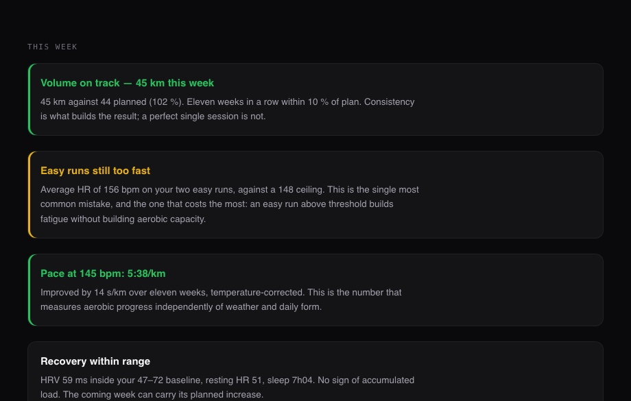
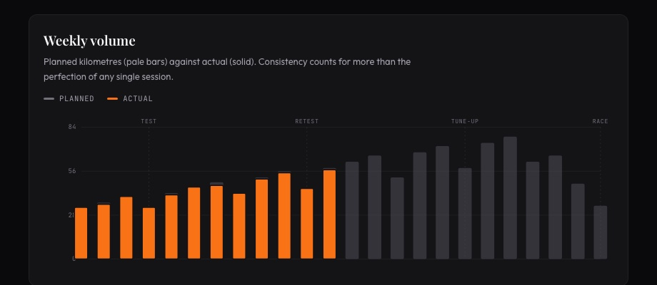
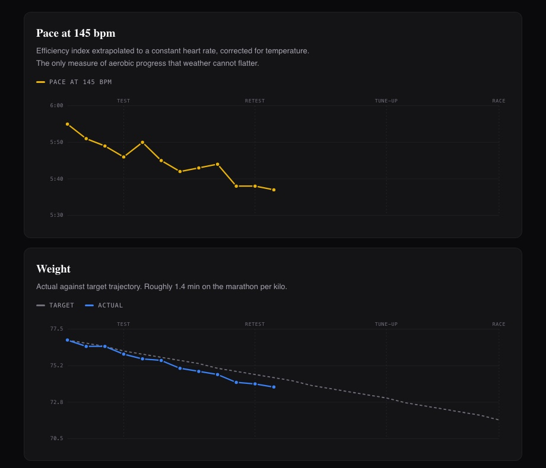
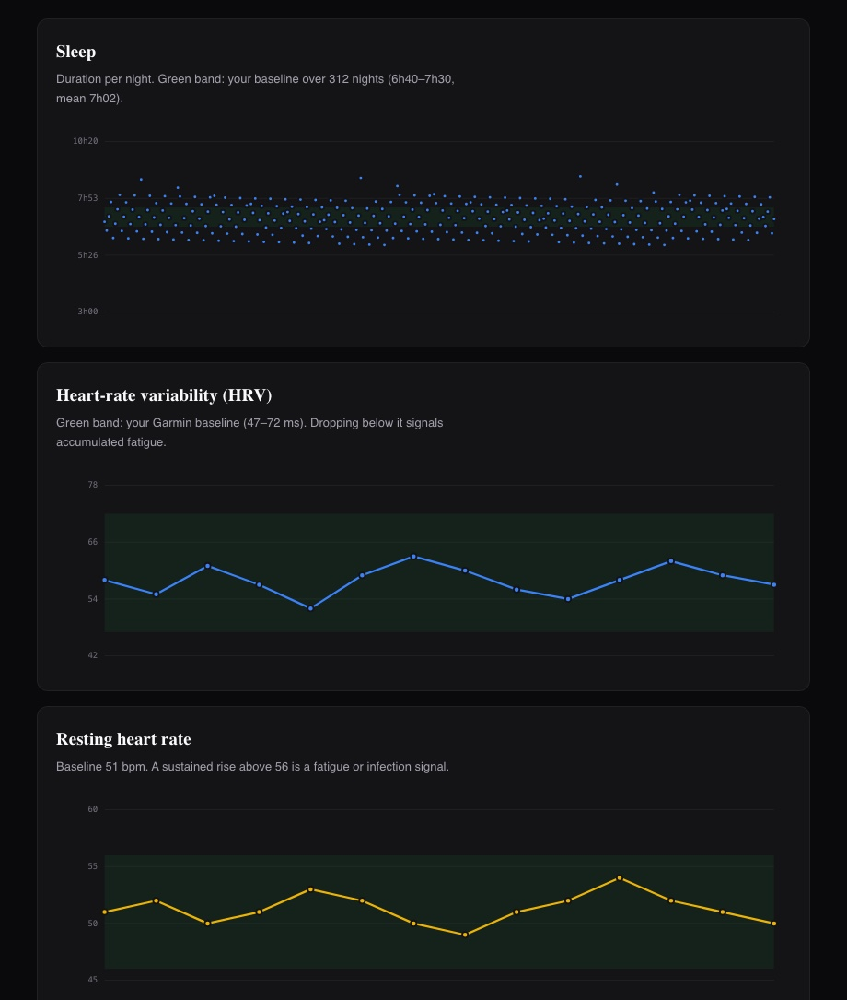
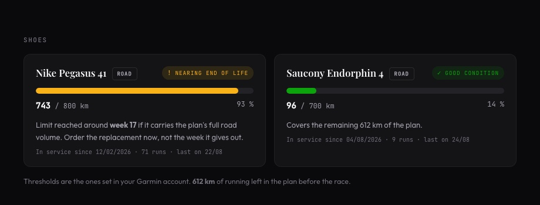
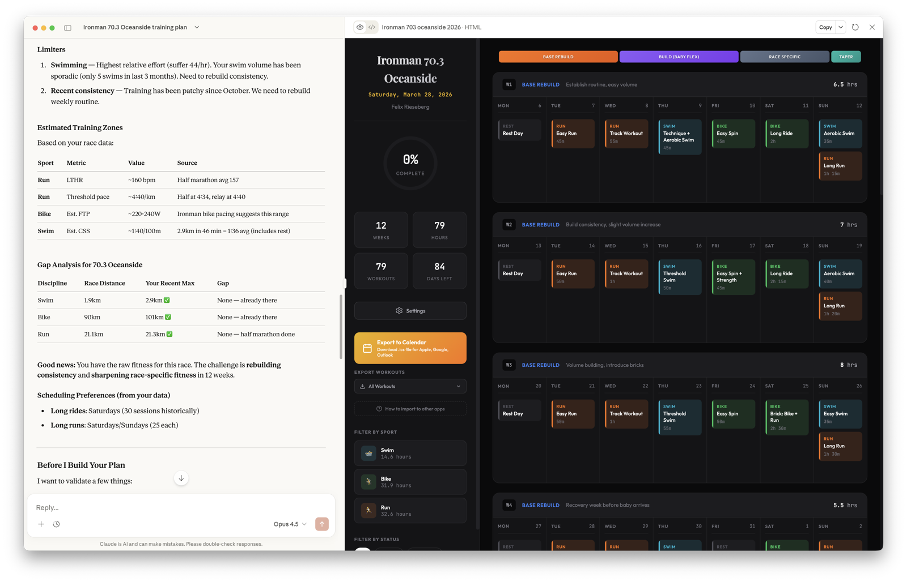

> **Traduction française du [README](../../README.md).** La version anglaise fait foi.
> Voir aussi : [architecture](architecture.fr.md) · [prompts](prompts.fr.md)

# Monday Coach

**Un fork de [claude-coach](https://github.com/felixrieseberg/claude-coach) qui garde le plan
honnête pendant les six mois qui suivent sa création.**

---

## Ce que claude-coach fait déjà — et fait bien

[claude-coach](https://github.com/felixrieseberg/claude-coach), de
[Felix Rieseberg](https://github.com/felixrieseberg), est le moteur. Il :

- **te fait passer un entretien** comme le ferait un entraîneur — course, objectif, jours
  disponibles, blessures, contraintes
- **lit ton historique Strava** et te dit honnêtement dans quelle forme tu es
- **construit le plan** : phases, zones, structure des séances, stratégie de course, le tout depuis
  une vraie méthode d'entraînement
- **le rend sous forme d'application** que tu peux éditer, réorganiser et cocher, hors ligne et sur
  téléphone
- **exporte chaque séance** vers agenda, Garmin, Zwift et TrainerRoad

C'est le plus dur, et c'est entièrement son travail. **Si tu veux juste un plan d'entraînement,
utilise claude-coach et arrête ta lecture ici.** Son README est conservé dans
[`docs/README.upstream.md`](../README.upstream.md).

---

## Ce que ce fork ajoute, et pourquoi ça compte

### D'abord, ce que tu peux déjà faire sans ce fork

**Soyons clairs sur la ligne de départ.** claude-coach plus le connecteur MCP officiel de Strava
t'emmène déjà loin. Le connecteur donne à Claude un accès en lecture à tes activités, ta fréquence
cardiaque par sortie, tes zones et le kilométrage de ton matériel — donc tu peux simplement
*demander* :

> *« Compare ma semaine au plan. Ma FC sur les sorties faciles était-elle trop haute ? Combien de
> kilomètres sur mes chaussures ? »*

et obtenir une bonne réponse. **Ce n'est pas ce fork. Ça marche déjà, tel quel.** Si ça couvre ton
besoin, tu n'as besoin de rien ici.

### Ce que ce fork change réellement

Trois choses, et elles sont plus étroites que « il en fait plus » :

**1 · Ça se produit sans que tu le demandes.** La comparaison ci-dessus n'existe que si tu penses à
la réclamer, chaque semaine, pendant six mois. Le mode de défaillance réel d'un plan
d'entraînement n'est pas un mauvais algorithme — c'est le quatrième lundi où tu n'ouvres pas
l'ordinateur. Ce fork est une tâche planifiée plus les scripts qu'elle pilote : le bilan s'écrit
seul, l'agenda se remplit seul, les fichiers de la montre sont prêts avant que tu les cherches.

**2 · Il utilise des données que Strava n'a pas.** Sommeil, variabilité cardiaque et FC de repos
viennent des exports de données Garmin. Strava n'en transporte rien, et aucun connecteur ne te les
donnera. Ce sont les chiffres qui préviennent *avant* que tu casses, pas après — et c'est ce qui
permet au bilan du lundi de dire « allège cette semaine » avec quelque chose derrière.

**3 · Ses réponses sont calculées, pas réimprovisées.** Pose la même question à Claude à deux
semaines d'intervalle et tu obtiens deux bonnes réponses qui ne sont pas tout à fait comparables.
Ici les chiffres sortent de scripts : même entrée, même sortie, semaine après semaine, avec la
comparaison d'une semaine sur l'autre qui rend une tendance visible. Et chaque sortie est vérifiée
— l'agenda est contrôlé contre ce qu'il contient réellement, pas contre ce qu'on croit y avoir
écrit.

C'est tout. Tout ce qui suit découle de ces trois points.

| | claude-coach + MCP Strava | + ce fork |
|---|---|---|
| Construit le plan | ✅ | l'utilise comme source de vérité |
| Lit ce que tu as réellement couru | ✅ si tu demandes | **sans le demander, et réécrit dans le plan** |
| Kilométrage des chaussures | ✅ via le matériel Strava | **+ seuil de remplacement et la semaine du plan où chaque paire lâche** |
| Sommeil, VFC, FC de repos | — | **depuis les exports de données Garmin** |
| Progrès indépendant de la météo | — | **allure à FC constante, corrigée de la température** |
| Semaine à venir dans l'agenda | tu télécharges un `.ics` | **écrite depuis le plan et vérifiée, chaque semaine** |
| Ajuster quand tu prends du retard | ✅ si tu demandes | **se fait tout seul, dans des limites fixes** |

Deux précisions honnêtes sur ce tableau :

- **Strava expose un flux de température** (`get_activity_streams`, `temp`), donc la correction
  thermique n'a pas strictement besoin de ce fork — mais le flux n'est renseigné que si ta montre a
  le capteur, et beaucoup ne l'ont pas. Ce que le fork ajoute, c'est de le faire
  *systématiquement*, avec une interrogation météo en repli. Sans correction, une prépa de l'été au
  printemps paraît 20 s/km plus rapide par simple refroidissement.
- **Strava expose le kilométrage du matériel**, donc « combien j'ai couru avec celles-ci ? » ne
  demande aucun fork non plus. Ce qui est ajouté, c'est le seuil de remplacement et la projection —
  *à quelle semaine du plan cette paire lâche-t-elle ?*

### À quoi ça ressemble

Ton objectif, toujours visible. Deux onglets : cet onglet de suivi, et le viewer de claude-coach à
côté.


Il s'ouvre sur **des phrases, pas des courbes** — chacune avec le chiffre qui la justifie.



Prévu contre réalisé. L'écart entre les deux est le chiffre le plus utile de la page.



Est-ce que tu progresses ? L'allure à 145 bpm constants, corrigée de la température — et le poids
contre sa cible.



Est-ce que tu récupères ? Chaque indicateur contre **ta** bande de normalité, calculée sur ton
propre historique — pas des moyennes de population. Une FC de repos à 51 n'a rien de notable en
général, et devient inquiétante chez quelqu'un qui tourne habituellement à 43.



Tes chaussures sont-elles mortes ? Une chaussure perd son amorti bien avant de paraître usée.



> Toutes les captures montrent un **coureur fictif**. Régénération : `./docs/demo/shoot.sh`.

Et le second onglet, qui est le viewer de claude-coach, inchangé :



*Capture issue du [dépôt claude-coach](https://github.com/felixrieseberg/claude-coach).*

---

## Ce que ce fork corrige dans claude-coach

Huit bugs, trouvés en l'utilisant intensivement pendant six mois. Tous dans deux fichiers.

**Sept dans l'export Garmin `.fit`** — la montre refusait silencieusement les séances, ou les
affichait sans nom :

| Bug | Correctif |
|---|---|
| `targetType: "heart_rate"` | `"heartRate"` — le SDK veut du camelCase |
| `durationType: "repeat_until_steps_cmplt"` | `"repeatUntilStepsCmplt"` |
| `subSport: "lap_swimming"` / `"strength_training"` | `"lapSwimming"` / `"strengthTraining"` |
| Champ `workoutStepName` | `wktStepName` — le vrai nom du champ ; l'autre est ignoré en silence |
| Champ `workoutName` | `wktName` — pareil |
| Pas de répétition placé *avant* ses enfants | Va *après* : `durationValue` = index du 1er enfant, `targetValue` = nombre de répétitions |
| FC écrite en bpm bruts | FIT lit 1–100 comme un % de FC max : 145 bpm devenait « 145 % de la max ». Converti |

**Un dans le viewer** — `loadCompleted()` ne lisait que le `localStorage` et écrasait le champ
`completed` du plan : une sortie réellement courue n'apparaissait jamais faite. Le plan fait
désormais autorité, et ça ne casse plus en origine opaque (`file://`, iframe `srcdoc`).

**Plus un problème de nommage, pas vraiment un bug :** la montre affiche le nom interne de la
séance, jamais celui du fichier — un mardi et un jeudi tous deux appelés « Endurance fondamentale »
se réduisaient à une seule entrée. Les noms sont maintenant préfixés par la date, date en tête,
parce que la montre tronque par la droite.

**Pourquoi sept bugs ont survécu ici sans être vus :** `.ics`, `.zwo` et `.mrc` avaient chacun
un fichier de tests. `.fit` n'en avait aucun. Ce fork ajoute
[`tests/viewer/export-fit.test.ts`](../../tests/viewer/export-fit.test.ts) — sept cas qui décodent
ce qui a été encodé, dont six échouent sur l'exporteur non corrigé. La suite complète fait
166 tests, tous au vert.

> Ces correctifs sont autonomes et s'appliqueraient proprement en amont.

---

## Récupérer le projet

```bash
git clone https://github.com/NicolasPateron/monday-coach.git
cd monday-coach
npm install
./harness/init.sh
```

Ou [télécharger le ZIP](https://github.com/NicolasPateron/monday-coach/archive/refs/heads/main.zip)
si tu préfères te passer de git.

`init.sh` crée les fichiers de travail dont l'outillage a besoin — aucun n'est versionné, parce
qu'ils contiennent des données personnelles. Il est rejouable sans rien écraser. Ensuite tu édites
`harness/athlete.json` (ta course, ton objectif, ton seuil mesuré) et tu suis le montage ci-dessous.

**Tu utilises déjà claude-coach et tu ne veux que les correctifs FIT ?** Deux fichiers et un test :

```bash
git remote add monday https://github.com/NicolasPateron/monday-coach.git
git fetch monday
git checkout monday/main -- src/viewer/lib/export/fit.ts src/viewer/stores/plan.ts tests/viewer/export-fit.test.ts
npm test
```

Rien d'autre dans ce fork n'est nécessaire pour qu'ils fonctionnent.

---

## Montage

Environ 90 minutes, une seule fois. Les étapes 3 et 4 sont celles de claude-coach ; le reste câble
la boucle autour.

| | | |
|---|---|---|
| **0** | **Demande ton export de données Garmin** sur garmin.com → Gestion des données. Jusqu'à 48 h, donc lance-le maintenant et continue. | 2 min |
| **1** | Installe [Claude Code](https://claude.ai/download), ouvre l'onglet **Code**, crée un dossier, choisis **Opus**. | 10 min |
| **2** | Branche Strava : **Customize → Connectors →** `https://mcp.strava.com/mcp`. Lecture seule. | 5 min |
| **3** | Installe la compétence coach — [prompt](prompts.fr.md#1--installer-la-compétence-coach). | 5 min |
| **4** | **Laisse la compétence construire ton plan.** C'est claude-coach qui fait son travail : l'entretien, les zones, le plan, le viewer. | 30 min |
| **5** | Charge ton historique Garmin — [prompt](prompts.fr.md#2--charger-ton-historique-garmin). | 10 min |
| **6** | Fabrique l'onglet de suivi — [prompt](prompts.fr.md#3--longlet-de-suivi). | 20 min |
| **7** | Programme le bilan du lundi — [prompt](prompts.fr.md#4--le-bilan-du-lundi). | 15 min |
| **8** | Essai à blanc, pour qu'il demande ses autorisations pendant que tu regardes. | 10 min |

> **Ne crée pas d'application Strava.** Le README de claude-coach décrit un chemin par Client ID et
> Client Secret — écrit avant que Strava publie un connecteur officiel. Avec le connecteur, tu n'en
> as pas besoin. Si la compétence en réclame un, réponds *« utilise le connecteur Strava déjà
> branché »*.

**Prérequis :** un abonnement Claude payant (Pro ou au-dessus), un abonnement Strava (le connecteur
est réservé aux abonnés), Python 3.9+, et Node 18+ pour le viewer et l'export FIT. La montre Garmin
est facultative — sans elle tu perds les
courbes de récupération et les séances guidées, et tu gardes tout le reste.

---

## Ta semaine, une fois que ça tourne

| Quand | Ce que tu fais |
|---|---|
| Chaque sortie | Rien. Ta montre synchronise avec Strava. |
| Lundi matin | Tu lis le bilan qui s'est écrit tout seul. **3 minutes.** |
| Lundi, facultatif | Tu déposes tes exports Garmin quotidiens dans Téléchargements. 2 min. |
| Quand tu te pèses | Tu ajoutes une ligne à un fichier. 10 secondes. |
| Quand tu achètes des chaussures | Tu le dis à Claude, en une phrase. |

Tu ne promptes jamais le bilan du lundi. Si tu te retrouves à taper « fais mon bilan », la tâche
planifiée ne tourne pas.

---

## Sous le capot

Douze scripts Python dans [`harness/`](../../harness/), environ 3 000 lignes, une commande :
`./harness/relancer.sh`.

**Aucun paquet Python tiers** — la bibliothèque standard seule. Deux choses sortent tout de même du
cadre : le décodage des `.fit` Garmin passe par Node et `@garmin/fitsdk`, dont claude-coach dépend
déjà, et `meteo.py` interroge Open-Meteo en HTTP simple (sans clé, sans compte).

Ce qui vaut la peine d'être connu est dans **[architecture.fr.md](architecture.fr.md)** :

- **pourquoi le pipeline n'a qu'un seul ordre valide** — s'être trompé une fois a effacé six
  semaines de progression visible
- **pourquoi le texte de l'agenda est généré et jamais saisi** — deux sources de vérité divergent
  toujours ; celle-ci a produit deux versions incompatibles de la même séance
- **comment les données sont validées avant d'en conclure quoi que ce soit** — quatre bugs
  d'extraction ont produit trois conclusions assurées et fausses sur le sommeil
- **la règle qui en est sortie** : *une destination qui n'est pas vérifiée n'est pas synchronisée*

---

## Confidentialité

Tout reste sur ta machine. Strava est en lecture seule et révocable. **Aucun mot de passe Garmin
n'est jamais demandé** — il n'existe pas de connecteur Garmin officiel, et les communautaires
réclament tes identifiants en clair ; ce projet utilise à la place des exports que tu télécharges
toi-même. Ton export Garmin contient les traces GPS de ton domicile : garde-le en local. La mémoire
est du texte que tu peux lire et effacer avec `/memory`.

---

## Limites

- **Ce n'est pas un avis médical.** Ce sont des propositions d'entraînement issues de tes données,
  produites par quelque chose qui ne t'a jamais examiné.
- **`harness/generate_plan.py` est calibré sur une préparation marathon précise.** La compétence
  `/coach` de claude-coach est l'outil générique, et pour la plupart des gens c'est le bon.
- **L'outillage est écrit en français** — commentaires, noms de scripts, texte des séances. Le
  traduire est la première contribution évidente.
- **Un athlète, une préparation.** Validé sur une seule prépa réelle.

---

## Remerciements

**Rien de tout ça n'existerait sans
[claude-coach](https://github.com/felixrieseberg/claude-coach) de
[Felix Rieseberg](https://github.com/felixrieseberg).**

Le plus dur était déjà fait : une vraie méthode d'entraînement, un entretien qui fait qu'on n'a
jamais besoin de savoir quoi demander, et un viewer de plan réellement bien fait. Tout ce qui est
ici est construit par-dessus.

Les bugs listés plus haut ne sont pas une critique — ils sont ce qui remonte quand un bon outil
rencontre une montre précise et six mois d'usage quotidien. Ils sont documentés en détail pour
pouvoir remonter vers l'amont si c'est utile.

## Licence

MIT, comme l'amont. Le copyright de l'œuvre originale reste à Felix Rieseberg. Voir
[`LICENSE.md`](../../LICENSE.md).
